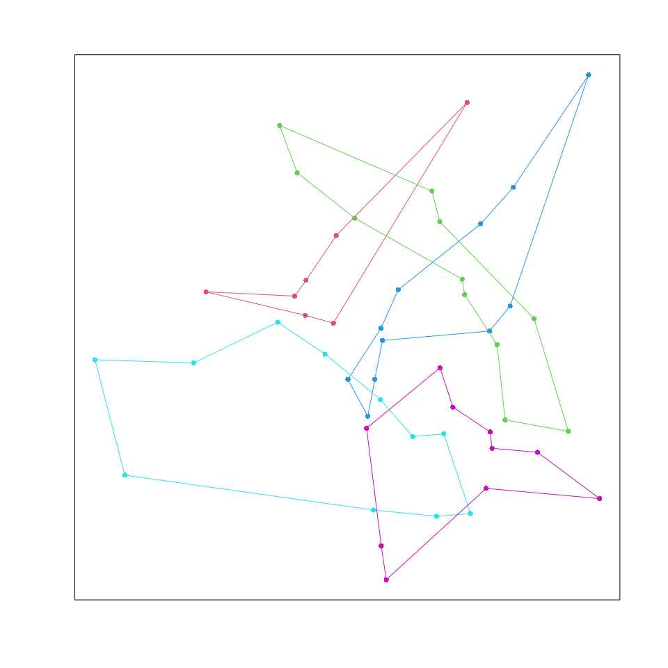

<!-- README.md is generated from README.Rmd. Please edit that file -->

# mtsp

Genetic algorithm to solve multiple travelling salespersons. Port of
matlab code found at
<https://uk.mathworks.com/matlabcentral/fileexchange/31814-mdmtspv_ga-multiple-depot-multiple-traveling-salesmen-problem-solved-by-genetic-algorithm>
and
<https://uk.mathworks.com/matlabcentral/fileexchange/19049-multiple-traveling-salesmen-problem-genetic-algorithm>.

Install package dependencies:

``` r
pkgs = c("Rcpp", "RcppArmadillo", "remotes" )
install.packages(pkgs)
```

Then install `mtsp` package from github:

``` r
remotes::install_github("daffp/mtsp")
```

Run some examples to see that it is working

``` r
library(mtsp)
set.seed(1)

# Matrix of node positions to visit
n = 50
xy = matrix(rnorm(n*2), ncol=2)

# Run search
run = mtsp(xy, nSalesmen=5, CostType=2, popSize=80, numIter=2000, algorithm="mtsp_ga", return_all=TRUE)
run
#> Total distance travelled for all salespersons = 33.49
#> Maximum distance travelled by a single salesperson = 7.42

summary(run)
#> Total distance travelled: 33.49
#> ================================
#> Salesperson 1 : distance travelled = 5.85
#> Tour: 13 -> 37 -> 20 -> 36 -> 1 -> 35 -> 46 -> 13
#> 
#> Salesperson 2 : distance travelled = 7.27
#> Tour: 50 -> 31 -> 39 -> 33 -> 5 -> 6 -> 45 -> 42 -> 44 -> 9 -> 19 -> 50
#> 
#> Salesperson 3 : distance travelled = 7.23
#> Tour: 43 -> 18 -> 11 -> 21 -> 40 -> 16 -> 32 -> 27 -> 10 -> 26 -> 23 -> 43
#> 
#> Salesperson 4 : distance travelled = 7.42
#> Tour: 3 -> 29 -> 38 -> 2 -> 30 -> 25 -> 47 -> 49 -> 24 -> 14 -> 28 -> 3
#> 
#> Salesperson 5 : distance travelled = 5.73
#> Tour: 4 -> 15 -> 22 -> 48 -> 7 -> 12 -> 41 -> 34 -> 17 -> 8 -> 4
```

Plot the solution

``` r
par(pty="s")
plot(run, ylim=c(-3,3), xlim=c(-3,3))
```



There is also a `ggplot2` method which can be run with `ggplotter(run)`.
